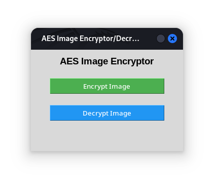
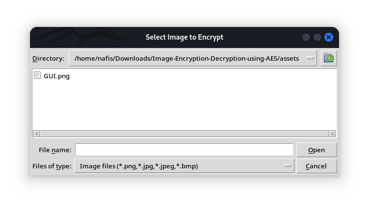
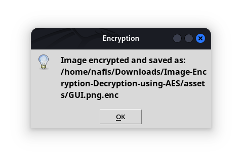

🔐 AES Image Encryption & Decryption Tool
A simple yet effective GUI-based application built with Python, Tkinter, and PyCryptodome to encrypt and decrypt image files using the AES (Advanced Encryption Standard) algorithm.

🧰 Features
📁 Encrypt common image formats: .png, .jpg, .jpeg, .bmp
🔐 AES encryption with a 128-bit key in CBC (Cipher Block Chaining) mode
🖥️ Lightweight and user-friendly Tkinter GUI
🔓 One-click decryption of .enc files back to original images
💡 Secure padding/unpadding and IV handling

📸 GUI Preview

Main Menu

Encryption Image Selection

Encryption Completed

🧪 Requirements
Python 3.x
pycryptodome
Pillow (PIL)

📦 Install dependencies
pip install pycryptodome Pillow

🚀 How to Run

🖥️ Directly
python3 project.py

💻 Using a Virtual Environment (Recommended)
python3 -m venv aesenv
source aesenv/bin/activate
pip install pycryptodome Pillow
python3 project.py

📂 How It Works
Choose an image file using the file picker.
Click Encrypt to generate a .enc file using AES encryption (CBC mode).
Later, select that .enc file and click Decrypt to restore the original image.
AES uses a static 16-byte key (ThisIsASecretKey) and a random IV (Initialization Vector), stored at the beginning of the encrypted file for secure decryption.

📌 Notes
This is a basic implementation designed for educational purposes.
For production-level use:
Use password-derived keys (e.g., PBKDF2)
Implement secure key management
Add authentication and integrity checks (e.g., HMAC)

📜 License
MIT License — Free to use for personal, academic, and educational purposes.

